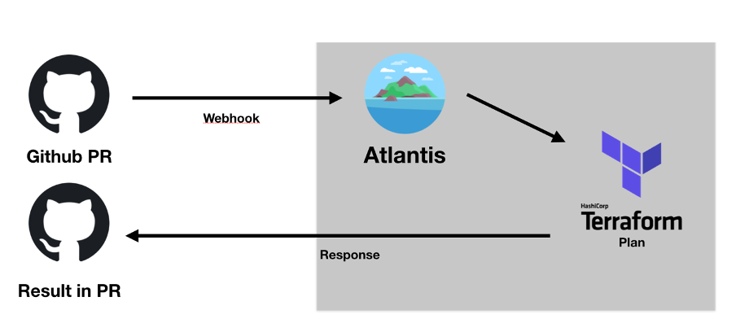

## tf-gitops-atlantis
Explore the power of GitOps and Terraform with Atlantis

Embracing Infrastructure as Code (IaC) with Atlantis: A Comprehensive Guide

In the fast-paced world of DevOps and cloud computing, Infrastructure as Code (IaC) has become a fundamental practice for managing, provisioning, and scaling cloud infrastructure. IaC enables teams to treat infrastructure configurations like code, bringing automation, collaboration, and version control into the world of infrastructure management. Among the various tools available, Atlantis shines as a powerful solution for implementing GitOps workflows with Terraform.

Traditional IaC Approach:

Modern GitOps IaC Approach:

### Table of Contents

- Introduction to Atlantis
- The GitOps Approach
- Getting Started with Atlantis
- Automating Terraform Workflows
- Collaborative Infrastructure Management
- Advanced Features
- Best Practices
- Installing and Configuring Atlantis
- Conclusion

_***1. Introduction to Atlantis***_

Atlantis is an open-source tool that enhances Terraform's capabilities by automating pull request (PR) reviews and executions. It integrates seamlessly with Git repositories and extends GitOps practices to infrastructure management. Atlantis simplifies and standardizes Terraform workflows, making collaboration and automation a breeze.

_***2. The GitOps Approach***_

GitOps is a methodology that treats Git repositories as the source of truth for defining infrastructure configurations. It leverages version control systems to manage infrastructure as code, allowing for transparency, accountability, and collaboration in the infrastructure management process. With GitOps, changes to infrastructure are initiated via pull requests, enabling automated reviews, approvals, and deployments.

_***3. Getting Started with Atlantis***_

Setting up Atlantis is a straightforward process. You'll need to configure Atlantis to integrate with your Git repository and your choice of continuous integration (CI) system. This setup enables Atlantis to automatically review and apply Terraform changes in response to PRs. It acts as a gatekeeper, ensuring that only approved and tested changes are applied to your infrastructure.

_***4. Automating Terraform Workflows***_

Atlantis simplifies Terraform workflows in several ways:

__Terraform Plan:__ Atlantis automatically generates and displays the Terraform plan for proposed changes within a PR. This allows teams to review the expected infrastructure modifications.

__Automated Reviews:__ Atlantis can be configured to perform automated reviews of PRs, checking for syntax errors, code quality, and potential issues.

__Scheduled Applies:__ Atlantis can also schedule Terraform applies at specified intervals, ensuring that infrastructure changes are implemented regularly and consistently.

__Notification Integration:__ Integration with chat and notification tools enables teams to stay informed about the status of infrastructure changes.

_***5. Collaborative Infrastructure Management***_

With Atlantis, infrastructure management becomes a collaborative effort:

__Standardized Workflow:__ All team members follow a standardized workflow, making it easy to review, approve, and apply changes.

__Version Control:__ Infrastructure configurations are version-controlled, providing a complete history of changes and the ability to roll back to previous states if needed.

__Parallel Development:__ Multiple team members can work on infrastructure changes simultaneously, all through Git PRs.

__Role-Based Access Control:__ Access to infrastructure changes can be controlled based on user roles, ensuring security and compliance.

_***6. Advanced Features***_

Atlantis offers advanced features for more complex infrastructure scenarios:

Multi-Repo Support: Manage multiple Terraform configurations across different repositories.

Custom Workflows: Tailor Atlantis to your team's specific workflows and requirements.

State Management: Support for remote state storage and management, allowing for collaboration across teams and repositories.

Extensive Logging: Detailed logs provide visibility into all activities and changes.

_***7. Best Practices***_

To maximize the benefits of Atlantis and GitOps with Terraform, consider the following best practices:

__Version Control Everything:__ Keep all infrastructure configurations in version-controlled repositories.

__Atomic Changes:__ Keep Terraform changes small and atomic to simplify review and deployment.

__Testing and Validation:__ Implement automated tests and validation checks for infrastructure changes.

__Documentation:__ Maintain clear and up-to-date documentation for infrastructure configurations.

__Collaboration:__ Encourage collaboration and communication among team members during the review and approval process.

__Security:__ Implement role-based access control and ensure secure handling of credentials and secrets.

_***8. Installing and Configuring Atlantis***_

Installing Atlantis is as simple as downloading the binary release, making it executable, and running it as a service to unlock automated Terraform workflows.

[Click here to get the steps for install and configuration of Atlantis on Ubuntu Server](docs/setup/install.md)

_***9. Conclusion***_

Atlantis, in conjunction with Terraform and GitOps, offers a robust solution for managing cloud infrastructure as code. By embracing GitOps principles and using Atlantis, organizations can achieve greater automation, transparency, and collaboration in their infrastructure management processes.

As the world of DevOps continues to evolve, Atlantis stands out as a tool that empowers teams to navigate the complexities of infrastructure management with ease. If you haven't explored Atlantis and GitOps yet, now is the time to dive in and experience the future of infrastructure as code.

Discover more about Atlantis and how it can transform your infrastructure management in our hands-on tutorial. Join us in the journey to streamline infrastructure management and embrace GitOps with Terraform and Atlantis.

Get started with Atlantis and GitOps now!

## License

This project is licensed under the [Apache License 2.0](https://www.apache.org/licenses/LICENSE-2.0) - see the LICENSE file for details.

Please replace `https://github.com/devopshubproject/tf-gitops-atlantis` with the URL of your Git repository if you have one. This README provides a comprehensive guide to your Terraform project and can be extended or modified as needed.

##  Follow-Me 

