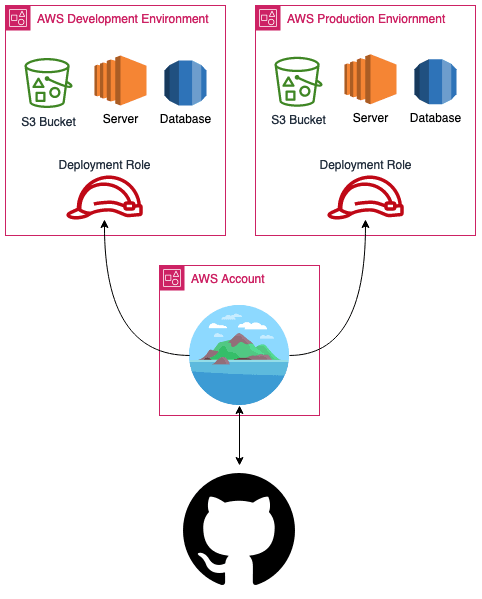
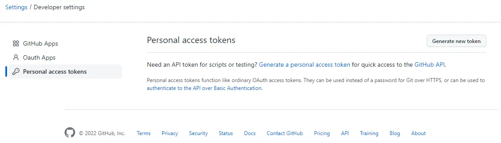
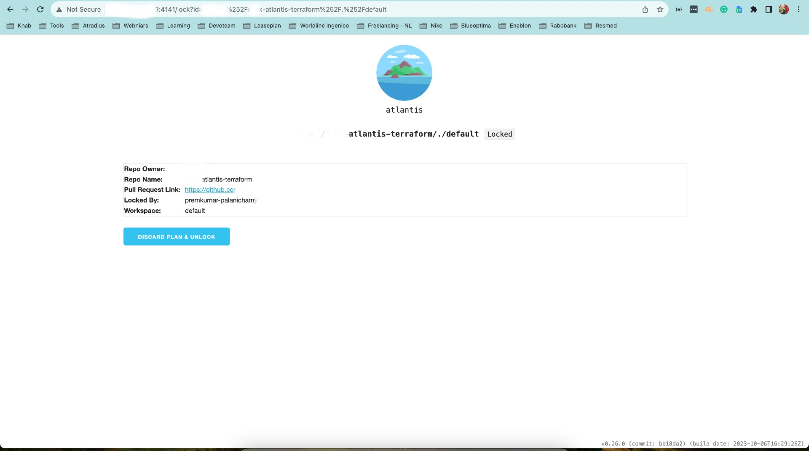

# Installing and Configuring Atlantis for GitHub Integration

Atlantis is a powerful open-source tool that simplifies Terraform workflows, enhances collaboration, and brings GitOps principles to infrastructure management. In this comprehensive guide, we'll walk you through the step-by-step process of installing and configuring Atlantis for seamless integration with GitHub. With Atlantis, you can automate Terraform deployments and streamline your infrastructure management.



1. Prerequisites

Before you begin, make sure you have the following in place:

> - An active GitHub account.
> - An AWS, GCP, or Azure account with necessary permissions for running Atlantis (if applicable).
> - A Git repository with Terraform code that you want to manage using Atlantis.
> - An Ubuntu server with administrative privileges.


2. Download the Atlantis Binary

Visit the Atlantis GitHub releases page to find the latest binary release: Atlantis Releases.

Choose the appropriate binary for your Ubuntu server. Atlantis provides binaries for Linux in different architectures (e.g., amd64, arm64). Download the binary that matches your server's architecture.

You can download the binary using curl. Replace version and architecture with the appropriate values:

```bash
curl -LO https://github.com/runatlantis/atlantis/releases/download/version/atlantis_linux_amd64
```

Rename the downloaded binary to just "atlantis" for convenience:

```bash
mv atlantis_linux_amd64 atlantis
```

Make the binary executable:

```bash
chmod +x atlantis
```

3. Create a Systemd Service

To run Atlantis as a service, create a systemd unit file. You can use a text editor to create the unit file. For example, you can use nano:

```bash
sudo nano /etc/systemd/system/atlantis.service
```

Add the following content to the __*atlantis.service*__ file:

```bash
[Unit]
Description=Atlantis Terraform Automation Server
After=network.target

[Service]
ExecStart=/path/to/atlantis server --config /path/to/atlantis.yaml
WorkingDirectory=/path/to/repos
User=atlantis
Group=atlantis
Restart=always
RestartSec=3

[Install]
WantedBy=multi-user.target
```

Replace /path/to/atlantis with the actual path to the Atlantis binary.

Replace /path/to/atlantis.yaml with the path to your Atlantis configuration file.

Replace /path/to/repos with the path to the directory containing your Terraform code repositories.

4. Create an Atlantis User

For better security and isolation, create an Atlantis user:

```bash
sudo useradd -m -s /bin/bash atlantis
```

5. GitHub Integration

To fully utilize Atlantis, you'll need to configure GitHub integration. 

First try to generate PAT token by following the below steps:

To generate a Personal Access Token (PAT) in GitHub:

- Log in to your GitHub account.
- Access your account settings.
- Navigate to "Developer settings" and select "Personal access tokens."
- Click "Generate token."
- Configure the token by setting a note, expiration, and scopes.
- Click "Generate token."
- Copy and securely save the token as it won't be displayed again.
- Use the PAT for GitHub operations, and keep it secure to protect your account.



6. Generate webhook Secrete string

To generate the webhook secrete string, you can either use the pythong script in the repo or you can use the give url below.

To run the script (after clone)

```py 
python generator.py
```

To generate from the website

[Click here to generate online](https://www.browserling.com/tools/random-string)

7. Integration with GitHub
For Atlantis to work with your GitHub repositories, you need to set up a webhook in your repository settings. Follow these steps:

In your GitHub repository, go to "Settings."

In the left menu, click on "Webhooks."

Click the "Add webhook" button.

In the "Payload URL" field, provide the URL where Atlantis is running. It should be in the format: http://your-atlantis-server:4141/events/github.

GitHub Webhook Configuration

Set the webhook to listen to specific events like "push" and "pull request."

Click "Add webhook" to save the settings.

8. Server-Side Configuration

To make server-side configuration you can use __*repos.yaml*__ file.

```
# repos lists the config for specific repos.
repos:
# id can either be an exact repo ID or a regex.
# If using a regex, it must start and end with a slash.
# Repo ID's are of the form {VCS hostname}/{org}/{repo name}, ex.
# github.com/runatlantis/atlantis
- id: /.*/
# allowed_overrides specifies which keys can be overridden by this repo in
# its atlantis.yaml file.
  allowed_overrides: [apply_requirements, workflow]
# allow_custom_workflows defines whether this repo can define its own
# workflows. If false (default), the repo can only use server-side defined
# workflows.
  allow_custom_workflows: true
```

9. Start Atlantis Service

Start the Atlantis service:

```sh
sudo atlantis server --gh-user=premkumar-palanichamy --gh-token=ghp_abcdefgh0123456789 --gh-webhook-secret <your secret> --repo-allowlist=github.com/your-org/* --repo-config=repos.yaml --skip-clone-no-changes --checkout-strategy=merge
```

Enable Atlantis to start on boot:

```bash
sudo systemctl enable atlantis
```

10. Verify the Installation

Check the status of the Atlantis service to ensure it's running without issues:

```bash
sudo systemctl status atlantis
```
You should see output indicating that Atlantis is active and running.

To access the atlantis web application:

Type your serverip with port number on the browser

```bash
http://<server-ip>:4141
```



11. Testing the Setup
Now that Atlantis and the GitHub webhook are configured, let's test the setup:

Make a change to your Terraform code in a GitHub repository.

Create a pull request for the changes.

Atlantis should automatically comment on the PR, providing a Terraform plan.

Atlantis PR Comment

You can merge the PR once Atlantis approves it.


Feel free to customize your Atlantis configuration/Troubleshoot to match your team's specific requirements, such as custom workflows and advanced settings. For advanced configurations and troubleshooting, consult the official Atlantis documentation.

[Official Atlantis Documentation](https://www.runatlantis.io/guide/)

With Atlantis in place, you're on your way to streamlined infrastructure management and automation.

Enjoy the benefits of Infrastructure as Code (IaC) with Atlantis, and happy Terraforming!